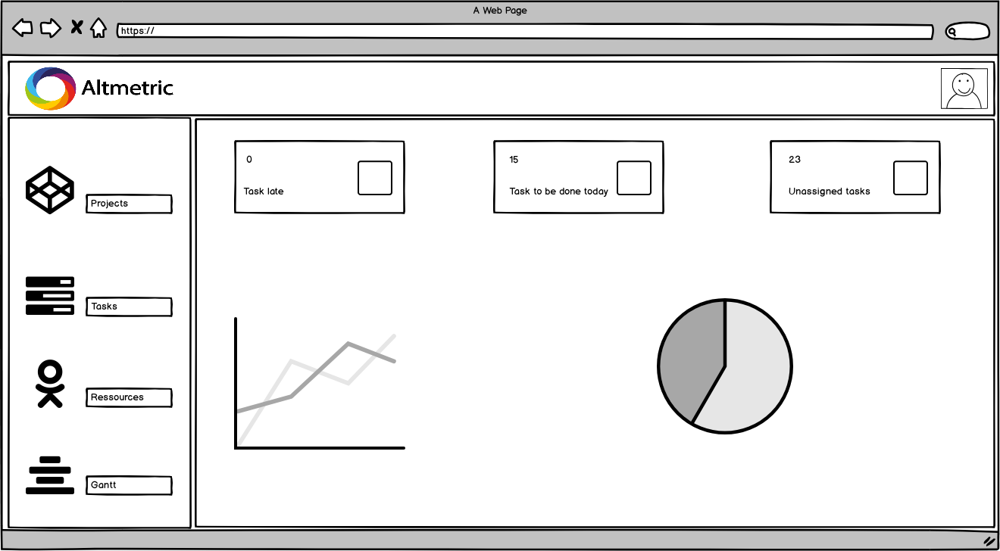
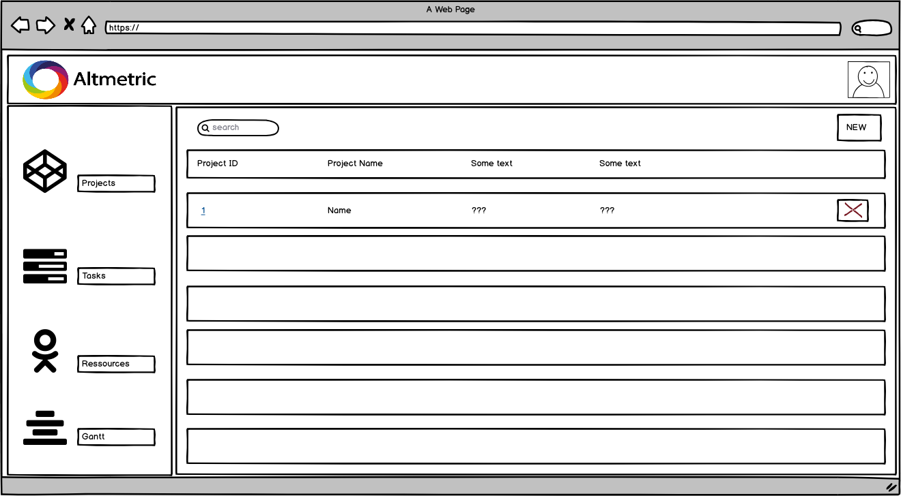
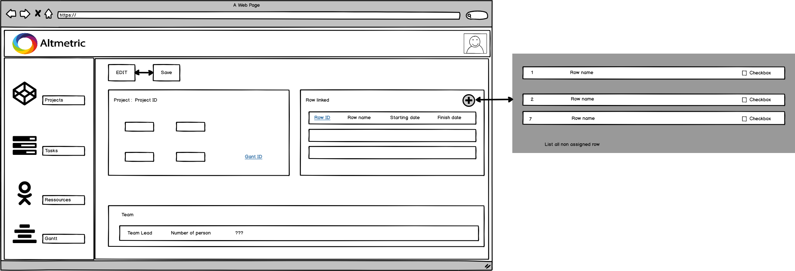
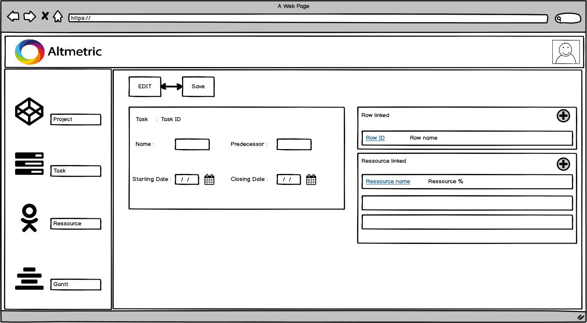
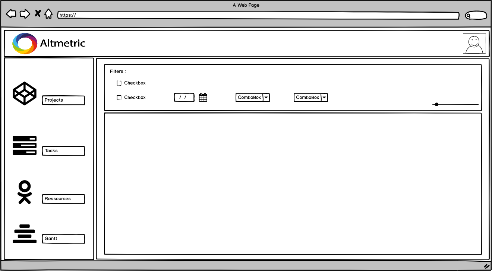

Environment
------
```javascript
"engines": {
    "node": "10.6.0",
    "npm": "6.1.0"
}
```

Install nvm for multiple node version throught directory : (deprecated no need for different version)
```
curl -o- https://raw.githubusercontent.com/creationix/nvm/v0.33.11/install.sh | bash
```
To install new version :
```
nvm install 10.6.0 // For server
```
To use it (got to base folder - like pt-server) :
```
nvm use 10.6.0 // For server
```

Git Flow
------ 

[Doc Git Flow](https://danielkummer.github.io/git-flow-cheatsheet/)

### Guidelines

- Create feature branch fore every feature and develop should be up-to-date before creating a branch
- Commit often 
- You should always merge develop into your branch before you publish your branch
- You merge your branch via pull request, so we can check

### Mockups

- Not 100% finished and well designed (we made some mistakes during conception) but still give some indication of what we need and how it will look like

- Dashboard :
  
- Project list view :
  
- Inside a project :
  
- Task view :
  
- Gantt view :
  